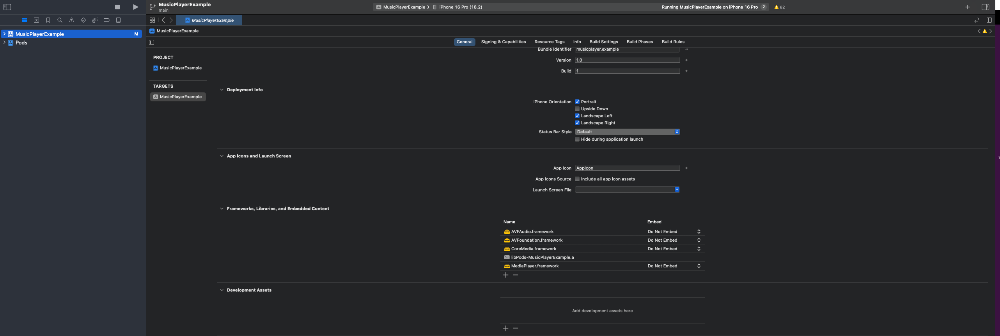

# `rn-audio-player`

**`rn-audio-player`** is a feature-rich package that allows apps to play audio from URL or file. Right now we are supporting IOS and Android. You can find the sample app using this [here](https://github.com/LiftOffLLC/rn-audio-player/tree/main/example).

---

## 🚀 Why Use This Package?

When there are existing solutions like `expo-av`, `react-native-music-player`, etc., this package stands out due to:

- **Integrated UI**: Comes with a fully functional full-page player and mini player.
- **Customizable Components**: UI elements are fully themeable to match your app's design.
- **Background Playback**: Supports audio playback in the background with media controls.
- **Powerful Hook**: Use the `usePlayer` hook to build your own custom UI with full control over the player state.
- **Context API Support**: Manage multiple media sessions effortlessly using our player context.

---

## 📦 Installation

> **Note:** Requires **Node.js v18+**

```bash
npm install @liftoffllc/rn-audio-player
# or
yarn add @liftoffllc/rn-audio-player
```

---

## ⚙️ Prerequisites

### iOS Permissions

Add the following to your **Info.plist**:

```xml
<key>NSMicrophoneUsageDescription</key>
<string>We need access to the microphone for audio playback</string>
<key>UIBackgroundModes</key>
<array>
  <string>audio</string>
  <string>processing</string>
  <string>fetch</string>
  <string>remote-notification</string>
</array>
```

If you plan to use the `AudioPlayer` or `MiniPlayer` components, they rely on `react-native-vector-icons`, so you’ll need to install and add the following permission to your `Info.plist` file.

```bash
npm install react-native-vector-icons
# or
yarn add react-native-vector-icons
```

```xml
<key>UIAppFonts</key>
<array>
  <string>Ionicons.ttf</string>
</array>
```

---

## 🛠️ Xcode Configuration

- Open your project in Xcode.
- Go to the `General` tab → **Frameworks, Libraries, and Embedded Content**.
- Add the following:

  - `AVFoundation.framework`
  - `AVFAudio.framework`
  - `CoreMedia.framework`
  - `MediaPlayer.framework`



---

## 🧩 Props

### AudioPlayer & MiniPlayer Props

| Prop                      | Type                     | Description                                                                                        |
| ------------------------- | ------------------------ | -------------------------------------------------------------------------------------------------- |
| `trackInfo`               | `object`                 | **Required**. Metadata like title, artist                                                          |
| `containerStyle`          | `ViewStyle`              | Style for the outer container.                                                                     |
| `iconStyle`               | `object`                 | Style for control icons                                                                            |
| `mediaStyle`              | `object`                 | Style for media section (thumbnail etc.)                                                           |
| `contentStyle`            | `object`                 | Style for title/artist metadata                                                                    |
| `iconComponents`          | `object`                 | Custom icon components for controls. ex: `playIcon`, `pauseIcon`, `previousIcon`, `repeatIcon` etc |
| `sourceUrl`, `filePath`   | `string`                 | URL or file path to the audio                                                                      |
| `autoPlay`                | `boolean`                | Auto start playback on load                                                                        |
| `repeat`                  | `boolean`                | Whether to repeat the track                                                                        |
| `shouldShowControls`      | `boolean`                | Show or hide control buttons                                                                       |
| `shouldShowMedia`         | `boolean`                | Show or hide media thumbnail                                                                       |
| `shouldShowContent`       | `boolean`                | Show or hide content (title/artist)                                                                |
| `shouldShowDuration`      | `boolean`                | Show or hide audio duration                                                                        |
| `customProgressIndicator` | `ReactNode`              | Custom component to show progress                                                                  |
| `customControls`          | `ReactNode`              | Custom component to render controls                                                                |
| `onPlay`                  | `() => void`             | Callback when playback starts.                                                                     |
| `onPause`                 | `() => void`             | Callback when playback is paused.                                                                  |
| `onSeek`                  | `(time: number) => void` | Callback when seeking to a specific time.                                                          |
| `onNext`                  | `() => void`             | Callback when skipping to the next track.                                                          |
| `onPrevious`              | `() => void`             | Callback when going to the previous track.                                                         |
| `onSeekForward`           | `() => void`             | Callback when seeking forward.                                                                     |
| `onSeekBackward`          | `() => void`             | Callback when seeking backward.                                                                    |
| `onFinished`              | `() => void`             | Callback when track finishes playing.                                                              |
| `seekInterval`            | `number`                 | Interval (in ms) for to seek. **Default: `3000`**                                                  |

---

## 🧪 Usage

### `usePlayer` Hook

```ts
import { usePlayer } from '@liftoffllc/rn-audio-player';

const { play, pause, stop, seek, toggleRepeat, loadContent } = usePlayer({
  repeat: false,
  autoPlay: false,
  seekInterval: 10,
  shouldPlayInBackground: true,
  onPlay: () => {
    console.log('play');
  },
  onPause: () => {
    console.log('pause');
  },
  onSeek: (time: number) => {
    console.log('seek', time);
  },
  onNext: () => {
    console.log('next');
  },
  onPrevious: () => {
    console.log('previous');
  },
  onSeekForward: () => {
    console.log('seekForward');
  },
  onSeekBackward: () => {
    console.log('seekBackward');
  },
  onFinished: () => {
    console.log('finished');
  },
  onStop: () => {
    console.log('stop');
  },
  onReady: () => {
    console.log('ready');
  },
  onProgress: (progress: number) => {
    console.log('progress', progress);
  },
});
```

### Context Wrapper

```tsx
import { PlayerProvider } from '@liftoffllc/rn-audio-player';

export default function App() {
  return (
    <PlayerProvider>
      <MyApp />
    </PlayerProvider>
  );
}
```

### `AudioPlayer` Component

```tsx
import { AudioPlayer } from '@liftoffllc/rn-audio-player';

<AudioPlayer
  trackInfo={{
    title: 'John doe Title',
    artist: 'John doe',
    album: 'John doe Album',
    url: 'https://dl.espressif.com/dl/audio/ff-16b-1c-8000hz.mp3',
    artwork:
      'https://encrypted-tbn0.gstatic.com/images?q=tbn:ANd9GcQAu2qz2_GGhotIzQJvsAY-GHK6NRmZzDDWCw&s',
  }}
/>;
```

### `MiniPlayer` Component

```tsx
import { MiniPlayer } from '@liftoffllc/rn-audio-player';

<MiniPlayer
  trackInfo={{
    title: 'John doe Title',
    artist: 'John doe',
    album: 'John doe Album',
    url: 'https://dl.espressif.com/dl/audio/ff-16b-1c-8000hz.mp3',
    artwork:
      'https://encrypted-tbn0.gstatic.com/images?q=tbn:ANd9GcQAu2qz2_GGhotIzQJvsAY-GHK6NRmZzDDWCw&s',
  }}
/>;
```

---
